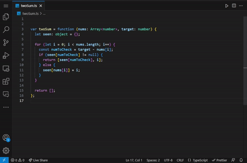

# CodeSense AI

CodeSense AI is a cutting-edge Visual Studio extension designed to enhance code documentation and comprehension through the power of artificial intelligence. Leveraging the capabilities of ChatGPT, CodeSense AI revolutionizes the way developers write comments for their code and understand complex programming concepts.

_Contact Information Below_

# Comment Generation

With CodeSense AI, writing comprehensive and meaningful comments becomes a breeze. Gone are the days of struggling to articulate the purpose, functionality, or intended usage of your code. Simply invoke the extension while editing your code, and CodeSense AI will generate clear and concise comments for you. It analyzes the code structure, variable names, and contextual information to provide accurate and context-aware comments that describe the code's purpose, inputs, outputs, and potential caveats.

_Default Keybind: Ctrl + Shift + /_

<!-- Developers can easily customize the comment style and level of detail to suit their preferences and project requirements. -->

# Code Explanation

This feature utilizes ChatGPT, an advanced language model, to provide clear and detailed explanations for code segments, helping developers understand complex logic and improve their code comprehension.

With CodeSense AI Explanation, unraveling intricate code becomes effortless. Simply select a code snippet in Visual Studio Code and invoke the feature with a click or a customizable keyboard shortcut. CodeSense Explanation then leverages the capabilities of ChatGPT to break down the code, identify key algorithms and patterns, and provide step-by-step explanations of its functionality.

_Default Keybind: Ctrl + Shift + F12_

<!--  -->

---

## Works with 9 languages

- Javascript
- Typescript
- PHP
- Python
- C
- C#
- C++
- Java
- Rust

## Coming Soon

- Docstring Comments
- Code Optimization
- Symbol Comments

## Contact

If you have any inquiries, comments, or concerns, please don't hesitate to contact us at admin@codesenseai.com. We highly value your feedback as it plays a pivotal role in our continuous efforts to enhance our product. We encourage you to provide feedback directly on our website at [Codesenseai.com](https://codesenseai.com). Your input is invaluable to us, and we appreciate your contribution to improving our services.

<!-- ## Release Notes

Users appreciate release notes as you update your extension. -->

<!-- ### 1.0.0

Initial release of ... -->

<!-- ### 1.0.1

Fixed issue #. -->

<!-- ### 1.1.0

Added features X, Y, and Z. -->

<!-- ## Working with Markdown

You can author your README using Visual Studio Code. Here are some useful editor keyboard shortcuts:

- Split the editor (`Cmd+\` on macOS or `Ctrl+\` on Windows and Linux).
- Toggle preview (`Shift+Cmd+V` on macOS or `Shift+Ctrl+V` on Windows and Linux).
- Press `Ctrl+Space` (Windows, Linux, macOS) to see a list of Markdown snippets.

## For more information

- [Visual Studio Code's Markdown Support](http://code.visualstudio.com/docs/languages/markdown)
- [Markdown Syntax Reference](https://help.github.com/articles/markdown-basics/)

**Enjoy!** -->
